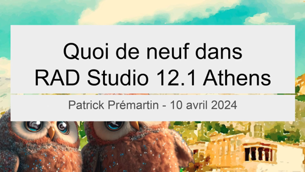

# Quoi de neuf dans RAD Studio 12.1 Athens ? (10 avril 2024)

* [la présentation en PDF](Quoi-de-neuf-dans-RAD-Studio-12_1-Athens.pdf)
* [liens complémentaires](liens-complementaires.md) en lien avec cette présentation

* [des notes sur RAD Studio 12 Athens](Nouveautes-de-RAD-Studio-12-Athens.pdf)

## Rediffusions de la présentation

* [présentation en ligne du 10 avril 2024](https://www.youtube.com/watch?v=2XZ7JPtd-88) sur la chaîne YouTube de [Barnsten](https://www.barnsten.com/fr/) (FR)
* [présentation en ligne du 10 avril 2024](https://serialstreameur.fr/quoi-de-neuf-dans-rad-studio-12-et-121-athens.html) sur le site de VOD [Serial Streameur](https://serialstreameur.fr/) (FR)
* [présentation en ligne du 10 avril 2024](https://videos.apprendre-delphi.fr/w/weRe2SshvYNz4q2B13aFx3) sur la chaîne PeerTube de [Apprendre Delphi](https://apprendre-delphi.fr) (FR)
