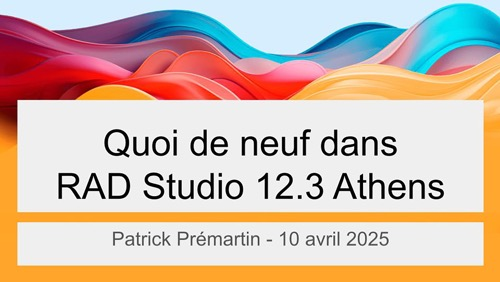

# Quoi de neuf dans RAD Studio 12.3 Athens ? (10 avril 2025)

* [la présentation en PDF](Quoi-de-neuf-dans-RAD-Studio-12_3-Athens.pdf)

Les liens de la rediffusion intégrale et de sa version montée sont indiqués dans la rubrique "[RAD Studio 12.3 Athens](#rad-studio-123-athens)".

# Liens complémentaires

## RAD Studio 12 Athens

* [what's new - launch webinar](https://www.youtube.com/watch?v=AtrpfZFfXAo) sur la chaîne YouTube d'[Embarcadero](https://www.embarcadero.com) (EN)
* [article de présentation de la version](https://blogs.embarcadero.com/announcing-the-availability-of-rad-studio-12-athens/) sur la plateforme de blogs (EN)
* [notes de version](https://docwiki.embarcadero.com/RADStudio/Athens/fr/Nouveautés) sur la documentation officielle (FR)

## RAD Studio 12.1 Athens

* [what's new - launch webinar](https://www.youtube.com/watch?v=8NjEEy--uFU) sur la chaîne YouTube d'[Embarcadero](https://www.embarcadero.com) (EN)
* [article de présentation de la version](https://blogs.embarcadero.com/announcing-the-availability-of-rad-studio-12-1-athens/) sur la plateforme de blogs (EN)
* [notes de version](https://docwiki.embarcadero.com/RADStudio/Athens/fr/12_Athens_-_Release_1) sur la documentation officielle (FR)

* [présentation en ligne du 10 avril 2024](https://www.youtube.com/watch?v=2XZ7JPtd-88) sur la chaîne YouTube de [Barnsten](https://www.barnsten.com/fr/) (FR)
* [présentation en ligne du 10 avril 2024](https://serialstreameur.fr/quoi-de-neuf-dans-rad-studio-12-et-121-athens.html) sur le site de VOD [Serial Streameur](https://serialstreameur.fr/) (FR)
* [présentation en ligne du 10 avril 2024](https://videos.apprendre-delphi.fr/w/weRe2SshvYNz4q2B13aFx3) sur la chaîne PeerTube d'[Apprendre Delphi](https://apprendre-delphi.fr) (FR)
* [notes, slides, PDF](../RAD-Studio-12_1-Athens.20240410) de cette présentation (FR)

## RAD Studio 12.2 Athens

* [what's new - launch webinar](https://www.youtube.com/watch?v=xkJKWstbZlc&pp=0gcJCX4JAYcqIYzv) sur la chaîne YouTube d'[Embarcadero](https://www.embarcadero.com) (EN)
* [article de présentation de la version](https://blogs.embarcadero.com/announcing-the-availability-of-rad-studio-12-2-athens/) sur la plateforme de blogs (EN)
* [notes de version](https://docwiki.embarcadero.com/RADStudio/Athens/fr/12_Athens_-_Release_2) sur la documentation officielle (FR)

## RAD Studio 12.3 Athens

* [what's new - launch webinar](https://www.youtube.com/watch?v=77bQ6Xs0kBE) sur la chaîne YouTube d'[Embarcadero](https://www.embarcadero.com) (EN)
* [article de présentation de la version](https://blogs.embarcadero.com/announcing-the-availability-of-rad-studio-12-3-athens/) sur la plateforme de blogs (EN)
* [notes de version](https://docwiki.embarcadero.com/RADStudio/Athens/fr/12_Athens_-_Release_3) sur la documentation officielle (FR)

* (bientôt) [présentation en ligne du 10 avril 2025](#) sur la chaîne YouTube de [Barnsten](https://www.barnsten.com/fr/) (FR)
* (bientôt) [présentation en ligne du 10 avril 2025](#) sur la chaîne PeerTube d'[Apprendre Delphi](https://apprendre-delphi.fr) (FR)

* [présentation de C++ Builder 12.x Athens (mars 2025)](https://www.youtube.com/watch?v=80vZrro_Btc&list=PLHLdMyq6m8_tIJnWKMZAf8lEUIxgpQEEm&index=2&pp=iAQB) sur la chaîne YouTube de [Barnsten](https://www.barnsten.com/fr/) (FR)

# Rediffusion de ma présentation du 10 avril 2025

* sur [YouTube](https://www.youtube.com/watch?v=kjjSK_2nx4M) (FR)

C'est la version intégrale, sans montage, de ma présentation des versions 12.x Athens de Delphi, C++Builder et RAD Studio.

Je vous recommande plutôt la version montée, plus courte et sans les pauses, hésitations, éternuements, ... prochainement disponible sur [la chaîne YouTube de Barnsten](https://www.youtube.com/@BarnstenFrance/featured) et [l'instance PeerTube d'Apprendre Delphi](https://videos.apprendre-delphi.fr).

# Autres liens

Et voici une liste loin d'être exhaustive des resources autour des versions 12.x Athens sur la documentation officielle ou la plateforme de blogs d'Embarcadero. De nombreux articles et vidéos ont aussi été créés et diffusés par la communauté des utilisateurs, notamment les MVP, sur leurs sites, forums et chaînes respectifs.

## Sur RAD Studio

https://blogs.embarcadero.com/rad-studio-12-2-athens-inline-patch-1-available/
https://blogs.embarcadero.com/rad-studio-12-2-athens-patch-2-available/

https://blogs.embarcadero.com/new-in-rad-studio-12-3-64-bit-ide-initial-release/

https://docwiki.embarcadero.com/RADStudio/Athens/en/Smart_CodeInsight
https://blogs.embarcadero.com/using-ai-llms-in-the-rad-studio-ide-with-smart-codeinsight/
https://blogs.embarcadero.com/ai-powered-smart-codeinsight-in-rad-studio-12-3/
https://blogs.embarcadero.com/rad-studio-smart-codeinsight-lm-studio-a-local-ai-alternative/

https://blogs.embarcadero.com/focus-mode-in-rad-studio-12-2-just-you-and-your-code/
https://blogs.embarcadero.com/rad-studio-web-development-reimagined-with-the-webstencils-template-engine/

https://blogs.embarcadero.com/improvements-to-the-vcl-image-collection-editor-in-12-3/
https://blogs.embarcadero.com/rad-server-gets-a-boost-in-rad-studio-12-3/
https://blogs.embarcadero.com/new-in-12-3-scripts-for-migration-from-interbase-express-to-firedac/

https://blogs.embarcadero.com/the-android-sdk-manager-gui-in-rad-studio-12-3/

## Sur Delphi

Je recomande à tout développeur Delphi (et leur hiérarchie hésitante face à tant d'alternatives plus présentes dans la presse et les médias) de regarder cette présentation de Ian Barker du 30 mars 2025 sur "[Who uses Delphi ?](https://blogs.embarcadero.com/who-uses-delphi-the-silent-success-behind-astronauts-theme-parks-satellites-and-a-multi-billion-ultimate-payday/)".

## Sur C++ Builder

https://blogs.embarcadero.com/practical-info-fast-parallel-compiling-with-cbuilder-12-2/
https://blogs.embarcadero.com/practical-info-packages-in-cbuilder-12-2/
https://blogs.embarcadero.com/introducing-amazing-cmake-support-in-cbuilder-12-2/
https://blogs.embarcadero.com/practical-info-using-cmake-with-cbuilder-12-2/
https://blogs.embarcadero.com/dynamic-packages-in-cbuilder-12-2/

https://blogs.embarcadero.com/upgrading-cbuilder-12-2-tip-1-the-patch/
https://blogs.embarcadero.com/upgrading-cbuilder-12-2-tip-2-handling-old-rtl/
https://blogs.embarcadero.com/upgrading-cbuilder-12-2-tip-3-massive-files-with-iostreams/
https://blogs.embarcadero.com/upgrading-cbuilder-12-2-tip-4-take-advantage-of-security-and-correctness/
https://blogs.embarcadero.com/upgrading-cbuilder-12-2-tip-4-1-2-check-out-compiler-safety-options/
https://blogs.embarcadero.com/upgrading-cbuilder-12-2-tip-4-%C2%BE-help-when-moving-from-32-to-64-bit/
https://blogs.embarcadero.com/upgrading-cbuilder-12-2-tip-5-split-out-eh-and-seh-exception-handling/
https://blogs.embarcadero.com/upgrading-cbuilder-12-2-tip-6-handling-libraries-with-autolinking/
https://blogs.embarcadero.com/upgrading-cbuilder-12-2-tip-7-bcc64x-tips/

https://blogs.embarcadero.com/safety-with-cbuilder-12-3-introducing-sanitizers/
https://blogs.embarcadero.com/instruction-sets-in-cbuilder-12-3/

## Divers

https://blogs.embarcadero.com/what-you-can-do-with-rad-studio-12-2/
https://blogs.embarcadero.com/rad-studio-12-2-every-new-and-enhanced-feature/
